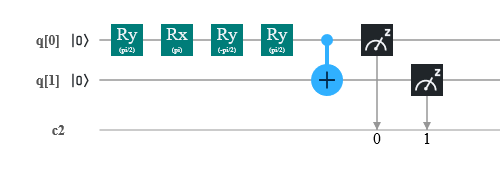

# Bell-State
Implementation of |00> + |11> bell state using Rx, Ry (Universal Quantum Gates) and CNOT gate. Testing the outcomes for different iterations on a real IBM's 5-qubit quantum computer.
<h2>Circuit</h2>
<h4>(On IBM Circuit Composer)</h4>

